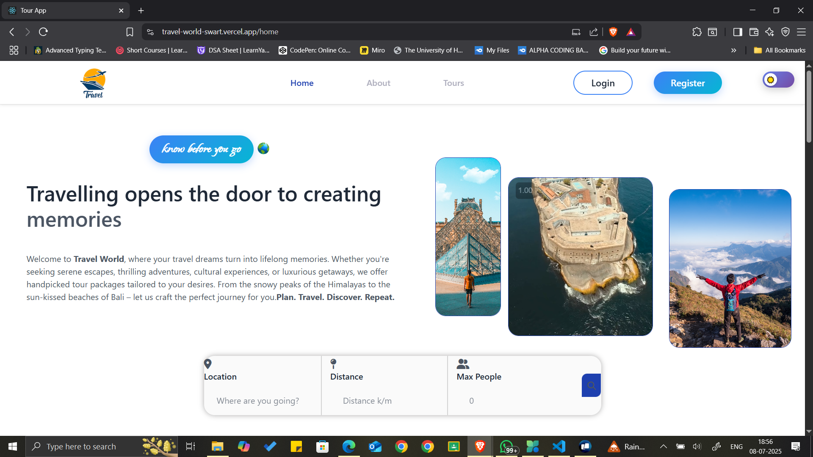

#                 Travel World
# 🧳 Travel Agency Booking System (MERN Stack)

A full-stack web application that simplifies travel bookings by allowing users to browse, book, and manage tour packages. Built using the MERN stack with secure authentication, real-time booking features, and responsive design.

---

## 📸 Project Screenshot

---

## 🚀 Features

- ✅ User Registration & Login with JWT Authentication
- 🧭 Browse Tour Packages (Flights, Hotels, Tours)
- 🔐 Admin Dashboard to Add, Edit, Delete Packages
- 🧾 Booking Management & Booking History
- 📡 RESTful API Integration (Tested with Postman)
- 🔑 Secure Password Hashing using Bcrypt
- 🛂 Role-Based Access Control (User/Admin)
- 🎨 Fully Responsive Frontend using ReactJS
- 🚀 Deployment using Render (Backend) and Vercel (Frontend)

---

## 🛠️ Tech Stack

| Layer     | Technologies                             |
|-----------|------------------------------------------|
| Frontend  | ReactJS, Axios, React Router DOM         |
| Backend   | NodeJS, ExpressJS                        |
| Database  | MongoDB (with Mongoose)                  |
| Security  | JWT, Bcrypt                              |
| Tools     | Postman, Git, GitHub                     |
| Hosting   | Vercel (Frontend), Render (Backend)      |

---

## 📁 Project Structure

